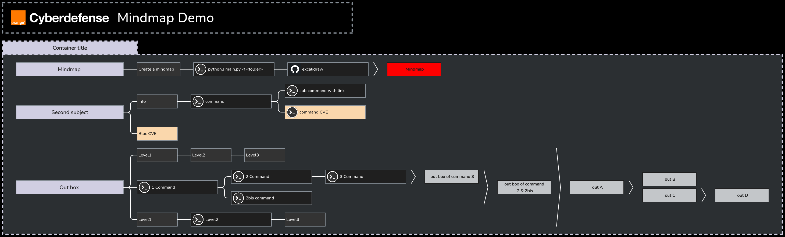
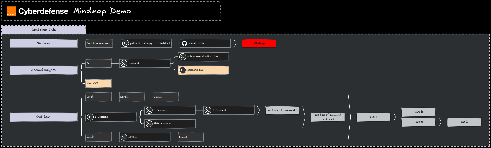
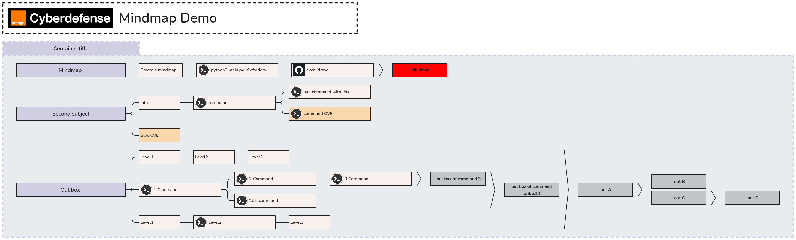
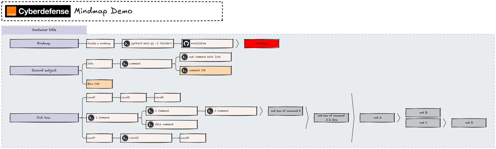

# Excalimap

Mindmap creation from Markdown to Excalidraw, with SVG/PNG export.

## Prerequisites

**For .excalidraw generation only:**
- Python 3
- `pyyaml`, `pillow` (`pip install -r requirements.txt`)

**For full export (SVG + PNG):**
- Everything above
- `podman` and `podman-compose`
- `rsvg-convert` (librsvg) for PNG conversion
- `curl`

## Usage

```bash
# Generate .excalidraw file only
./generate.sh mindmap/example

# Generate .excalidraw + SVG + PNG
./generate.sh mindmap/example -e

# With theme and style options
./generate.sh mindmap/example -t light -s handraw -e
```

Options:
- `-t, --theme` : `dark` (default) or `light`
- `-s, --style` : `classic` (default) or `handraw`
- `-e, --export` : export to SVG + PNG (starts Kroki automatically)

The `-e` flag starts a [Kroki](https://kroki.io/) instance via `podman-compose` if not already running, exports to SVG, then converts to PNG with `rsvg-convert`.

```bash
# Stop Kroki when done
podman-compose down
```

Output files go to `output/` (.excalidraw) and `output/svg/` (.svg, .png).

You can also open any `.excalidraw` file directly at https://excalidraw.com/

## Creating a mindmap

Create a folder in `mindmap/` with:
- `conf.yml` — configuration (title, layout, tools, colors)
- One or more `.md` files — the mindmap content

### conf.yml

```yml
main_title: Mindmap Demo
main_title_logo: ocd
matrix:
  - ['example']
tools:
  excalidraw:
    icon: github
    link: https://excalidraw.com/
color_id:
  demo: "#D0CEE2"
  mindmap: "#FF0000"
container_color:
  Container title: demo
out:
  out box: demo
  Mindmap: mindmap
```

- `main_title` — title displayed at the top
- `main_title_logo` — icon file name from `icon/` (without .png)
- `matrix` — layout grid of .md file names (rows/columns)
- `tools` — tool name to icon + link mapping (icons appear next to commands)
- `color_id` — named color palette
- `container_color` — color for `# Heading` containers
- `out` — color for `>>>` output boxes

### Markdown syntax

```markdown
# Container title

## Mindmap >>> Mindmap
- Create a mindmap
  - `python3 main.py -f <folder>`
    - `excalidraw`

## Second subject
- Info
  - `command`
    - `sub command with link`
[https://example.com](https://example.com)
    - `command CVE` @CVE@
- Bloc CVE @CVE@

## Out box >>> out A >>> out B || out C >>> out D
- Level1
  - Level2
    - Level3
- `1 Command` >>> out box of command 2 & 2bis
  - `2 Command`
    - `3 Command` >>> out box of command 3
  - `2bis command`
- Level1
  - `Level2`
    - Level3
```

- `# Heading` — container (top-level box)
- `## Heading` — title (section within a container)
- `- text` — info node
- `` - `code` `` — command node (with tool icon if configured)
- `>>> label` — output box (colored per `out` config)
- `>>> A || B` — parallel output boxes
- `@CVE@` — marks a node as CVE (highlighted)
- `[url](url)` — adds a link to the previous node

## Examples

Two examples are included:
- `mindmap/example/` — minimal demo showing all features
- `mindmap/ad-example/` — AD pentest "No Credentials" phase

## Result

- Dark / Classic : `./generate.sh mindmap/example`


- Dark / Handraw : `./generate.sh mindmap/example -s handraw`


- Light / Classic : `./generate.sh mindmap/example -t light -s classic`


- Light / Handraw : `./generate.sh mindmap/example -t light -s handraw`

